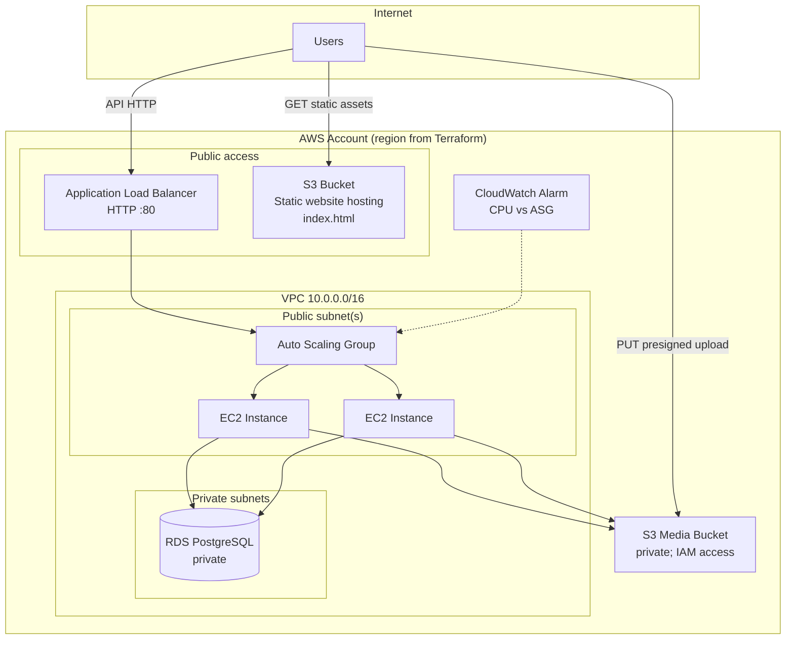
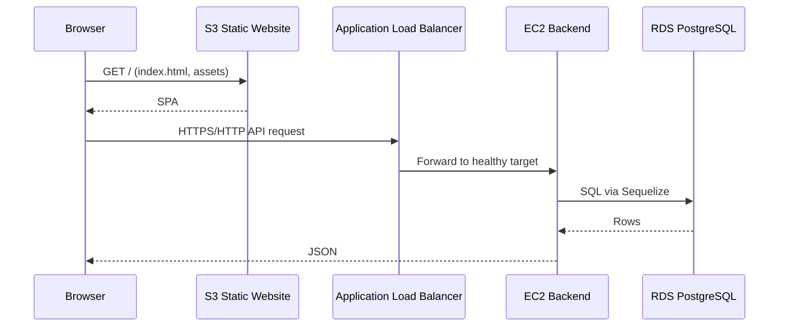
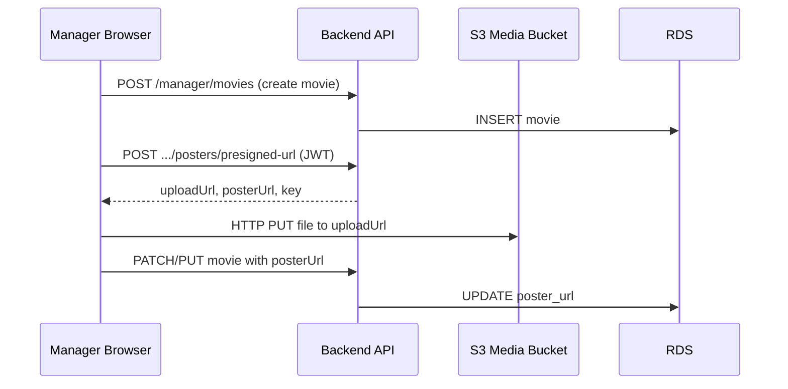
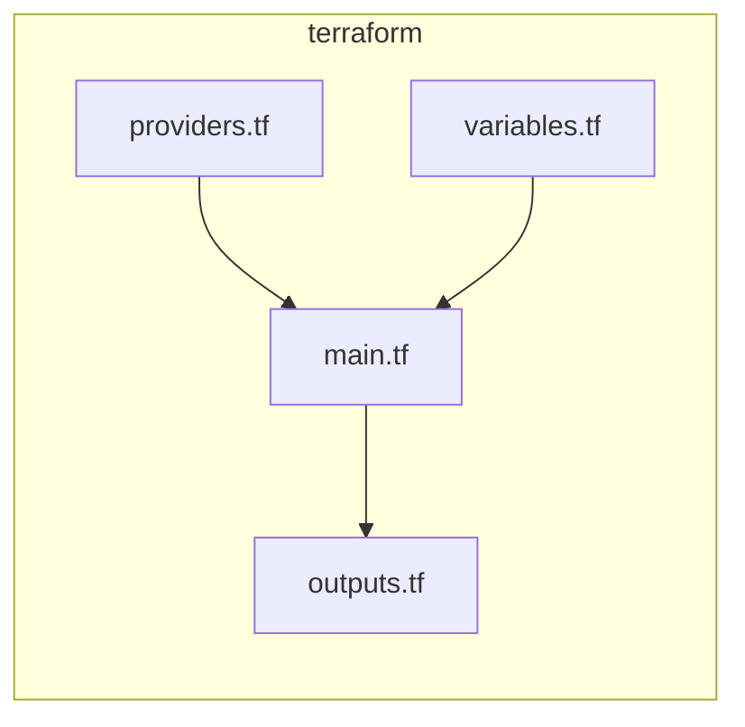

# GRAND CINEPLEX — Cloud Migration & AWS Deployment Report

## 1. Purpose and scope of this document

This report describes the **transition of GRAND CINEPLEX from a locally developed full-stack cinema application** (Backend Development, Year 2 Term 3) **to a cloud-hosted system on Amazon Web Services (AWS)**. The original coursework delivered the **core web application**: role-based UIs, REST APIs, PostgreSQL data model, booking and payment flows, and manager tooling. This phase focuses on **cloud readiness**, **object storage**, **managed relational database connectivity**, and **infrastructure as code (Terraform)** so the same application can run **accessibly over the internet**, with a path toward **horizontal scaling** (load balancer and auto scaling group).

**What this report covers (concrete implementation only):**

- Application changes required for **S3-backed poster storage** using **presigned PUT URLs**.
- **Sequelize** configuration aligned with **Amazon RDS for PostgreSQL**.
- **Terraform-provisioned AWS architecture**: VPC, RDS, EC2 (launch template + ASG), ALB, S3 (frontend + media), CloudWatch alarm.
- **Operational outputs** (DNS endpoints, website endpoint) and **deployment outcome**.

**Explicitly out of scope here:** optional enhancements (CDN, HTTPS/ACM, CI/CD, etc.) and alternative stacks; those are not part of the delivered baseline.

---

## 2. Baseline application (prior coursework)

The pre-cloud system is a **cinema management platform** with three operational perspectives:

| Role | Purpose |
|------|---------|
| **Customer** | Browse movies and showtimes, select seats, book and pay online. |
| **Cashier** | Walk-in sales, assisted bookings, payment handling. |
| **Manager** | Movies, screenings, theaters, staff, and operational oversight. |

**Representative features** include: movie catalog and screening schedules, seat-level reservations, ticketing and payments, JWT-based authentication with role middleware, and a PostgreSQL schema covering cinemas, theaters, seats, movies, screenings, customers, staff, bookings, tickets, and payments.

That application was suitable for local or single-host deployment. **Moving to AWS required** externalizing configuration, **stateless** backend assumptions (no reliance on local disk for uploads), and **managed** database and storage services.

---

## 3. Phase A — Cloud readiness: refactoring

### 3.1 External configuration

Runtime behavior is driven by **environment variables** so the same codebase can target local development, staging, and AWS without hardcoding secrets or endpoints.

| Variable | Role |
|----------|------|
| `DATABASE_URL` | PostgreSQL connection string for Sequelize (`postgresql://...`). |
| `JWT_SECRET` | Secret for signing and verifying JWTs (middleware and login flows). |
| `AWS_REGION` | Region for the AWS SDK (S3 client and presigner). |
| `S3_BUCKET` | Target bucket name for poster objects. |
| `S3_PUBLIC_BASE_URL` (optional) | Overrides the computed public URL prefix for `posterUrl` when a custom base (e.g. static website or CDN origin) is used. |
| `S3_KEY_PREFIX` (optional) | Defaults to `movie-posters`; prefixes object keys. |

On EC2, **database credentials** are injected via Terraform user data into `.env` as part of `DATABASE_URL`; the **S3 bucket name** and region are set the same way. **JWT and any other secrets** should be supplied through secure configuration in production (the deployment baseline emphasizes env-based configuration rather than embedding values in source code).

### 3.2 From “poster URL string” to S3 uploads (presigned URLs)

**Previous behavior:** the manager UI collected a **poster image URL** (`posterUrl` string). The API persisted that string in `Movie.poster_url`. There was **no multipart upload**, no S3 SDK usage, and no server-side file storage abstraction.

**Target behavior:** managers **choose an image file** in the browser. The **browser uploads directly to S3** using a **short-lived presigned PUT URL** issued by the backend. The database still stores a **single string** (`posterUrl`)—now the **canonical HTTPS URL** of the object so `` continues to work.

**Object key layout:** `movie-posters/{movieId}/{uuid}.{extension}` so each poster is namespaced per movie and unique per upload.

**Why presigned URLs:** the backend never streams the file bytes through the application server for storage. It only **authorizes one PUT** to a specific key and returns the **final public URL** for persistence. That reduces backend load and aligns with common cloud patterns.

**Short-lived credential:** presigned URLs are generated with a **limited lifetime** (implementation uses **600 seconds / 10 minutes** via `expiresIn` on the signer). After expiry, the URL cannot be used to upload; the client must request a new presigned URL if needed.

**Backend implementation (summary):**

- Dependencies: `@aws-sdk/client-s3`, `@aws-sdk/s3-request-presigner`.
- Service module `src/server/src/services/s3PosterService.ts` builds `PutObjectCommand`, signs it, and returns `{ uploadUrl, posterUrl, key }`.
- Controller `getMoviePosterPresignedUrl` validates `movieId` and `fileName`, ensures the movie exists, then calls the service.
- Route: `POST /manager/movies/posters/presigned-url`, protected by **manager JWT** (`authMiddlewareManager`).

**AWS credentials for the SDK:**

- **On AWS EC2:** the instance uses an **IAM instance profile** attached to the launch template. The SDK picks up **temporary credentials from the instance metadata**—no long-lived access keys in application code for presigning.
- **Local development:** developers typically configure the AWS SDK via the standard credential chain (e.g. environment variables or `~/.aws/credentials`) with permission to `PutObject` on the target bucket.

**Frontend flow:**

- **Add movie:** create the movie **first** (poster optional) to obtain `movieId` → request presigned URL → **HTTP PUT** file to `uploadUrl` → **update** the movie with `posterUrl` returned by the API (matches the key layout that includes `movieId`).
- **Edit movie:** if a **new file** is selected, repeat presign → PUT → `updateMovie` with new `posterUrl`; otherwise keep the existing URL.

**Operational note:** the **media bucket** is **private** in Terraform; **public read** for poster URLs typically requires a **bucket policy** (or CloudFront) on the object prefix used for public `GET`. The implementation computes `posterUrl` as either `S3_PUBLIC_BASE_URL` + key or the **virtual-hosted–style** S3 URL `https://{bucket}.s3.{region}.amazonaws.com/{key}`. **CORS** on the bucket must allow **PUT** from the frontend origin during development and production.

### 3.3 Sequelize and Amazon RDS

RDS PostgreSQL commonly requires **SSL** from clients. Sequelize is configured in `src/server/src/db/index.ts` with:

- `dialect: "postgres"`
- `dialectOptions.ssl`: `require: true`, `rejectUnauthorized: false` (typical for RDS-managed certificates in academic / rapid deployment contexts)

The connection string comes from **`DATABASE_URL`**, which is updated to the **RDS endpoint** after provisioning. No schema change was required for posters beyond continuing to store a URL in `poster_url`.

### 3.4 Stateless backend

The backend does **not** persist uploaded images on local disk for production flows. **JWT** remains the session mechanism; **state** for bookings and catalog remains in **PostgreSQL**. File content lives in **S3**; the API stores **references** (URLs) only.

---

## 4. Phase B — AWS architecture (Terraform)

### 4.1 Design intent

| Concern | AWS service | Role |
|---------|-------------|------|
| Isolated networking | **VPC**, subnets, **Internet Gateway**, route tables | Segments public-facing compute from private database tiers. |
| Managed relational DB | **RDS** (PostgreSQL, `db.t3.micro`) | Durable, managed PostgreSQL with backups configurable at the instance; not publicly accessible. |
| Application runtime | **EC2** (`t3.micro`) via **Launch Template** + **Auto Scaling Group** | Runs Node.js backend; ASG maintains desired capacity across AZs (as configured). |
| Traffic entry | **Application Load Balancer (ALB)** | Single DNS name for clients; health checks; distributes HTTP to targets. |
| Static UI | **S3** static website hosting | Serves built React assets from a dedicated bucket. |
| Media storage | **S3** (separate bucket) | Poster objects; accessed by backend via IAM; browser upload via presigned URLs. |
| Monitoring hook | **CloudWatch** metric alarm | CPU alarm on ASG dimension (baseline for capacity signals). |

### 4.2 High-level architecture

**Traffic split:** end users load the **single-page app** from the **S3 website endpoint**. API calls from the browser go to the **ALB DNS name** (configured in the frontend build as `VITE_API_BASE_URL`). **Direct PUT** to S3 uses the **presigned URL** returned by the API (browser → S3, not through ALB for the upload bytes).

### 4.3 Terraform layering and repository layout

Infrastructure lives under `terraform/`:

| File | Responsibility |
|------|----------------|
| `providers.tf` | Terraform block; **AWS provider** pinned to `~> 5.0`; region from `var.aws_region`. |
| `variables.tf` | `aws_region`, `db_username`, `db_password` (sensitive). |
| `main.tf` | All resources: network, RDS, IAM, EC2 launch template, ASG, ALB, S3, CloudWatch alarm. |
| `outputs.tf` | Values needed after `terraform apply` for app configuration and testing. |

**Resource order (dependency-driven in Terraform):**

1. **Network:** VPC (`10.0.0.0/16`), Internet Gateway, public subnet (`10.0.1.0/24`), two private subnets across AZs, public route to IGW, subnet association.
2. **RDS:** Security group (PostgreSQL **5432** from VPC CIDR), DB subnet group (private subnets), `aws_db_instance` (PostgreSQL, not publicly accessible).
3. **Compute IAM:** IAM role for EC2, attach **AmazonS3FullAccess** and **CloudWatchAgentServerPolicy**, instance profile for launch template.
4. **EC2 security group:** ingress **80** (and **22** for SSH in current definition), egress all.
5. **Launch template:** AMI, instance type, IAM profile, user data (Node.js, clone repo, `.env` with `DATABASE_URL`, `S3_BUCKET`, `AWS_REGION`, process manager start).
6. **ASG:** desired/min/max capacity, subnets for instances, launch template version.
7. **ALB:** internet-facing, listeners, target group (HTTP, health check path **`/health`**), attachment to ASG.
8. **S3:** frontend bucket + website configuration + public read policy; media bucket + public access block (private).
9. **CloudWatch:** CPU alarm on `AWS/EC2` `CPUUtilization` filtered by ASG name.

### 4.4 Security model (baseline)

- **RDS** is in **private subnets** and **not** publicly accessible; only resources inside the VPC (e.g. EC2) can reach port 5432 per security group rules.
- **EC2** receives HTTP from the internet in the current security group definition (ALB and instances share a group in `main.tf`); tightening to **ALB-only** ingress on instances is a typical production hardening step.
- **S3 access from the app** uses the **EC2 instance profile** (no static AWS keys in code for production).
- **Manager-only presign endpoint** remains protected by **JWT** so arbitrary clients cannot mint upload URLs.

### 4.5 Terraform outputs (hand-off values)

After `terraform apply`, outputs include:

| Output | Meaning |
|--------|---------|
| `alb_dns_name` | DNS name of the load balancer — **base URL for API** (e.g. `http://<name>.elb.amazonaws.com`). |
| `s3_website_endpoint` | S3 **static website** host for the frontend (regional website endpoint format). |
| `db_endpoint` / `rds_endpoint` | RDS **hostname:port** for PostgreSQL (duplicated in outputs for convenience). |

These values connect **infrastructure** to **application configuration**: the client build uses the ALB URL; the backend on EC2 receives `DATABASE_URL` and bucket name via deployment-time environment injection.

---

## 5. End-to-end flows

### 5.1 Read path (customer/cashier/manager API)

### 5.2 Poster upload path (presigned PUT)

---

## 6. Deployment procedure (summary)

1. **Infrastructure:** `terraform init` → `terraform plan` → `terraform apply`; record outputs.
2. **Database:** schema and seed data applied **from within the VPC** (or via bastion), because RDS is private.
3. **Frontend:** production build with `VITE_API_BASE_URL` pointing at **`http://<alb_dns_name>`**; upload build artifacts to the **frontend S3 bucket** and enable static hosting (already defined in Terraform).
4. **Backend:** EC2 user data automates clone, `npm install`, and start; `.env` receives `DATABASE_URL`, `S3_BUCKET`, `AWS_REGION` from Terraform interpolation.

---

## 7. Outcomes and current validation status

### 7.1 What `terraform apply` produces

- A **VPC** with public and private subnets suitable for the described topology.
- A **private RDS PostgreSQL** instance for application data.
- **EC2 instances** in an **Auto Scaling Group** behind an **ALB**, serving the API on port **80** with health checks to **`/health`**.
- Two **S3 buckets**: one for **static frontend**, one for **private media** referenced by the application and presigned uploads.
- A **CloudWatch** CPU alarm associated with the ASG name.

### 7.2 Links and configuration mapping

| Artifact | Where to obtain it | Typical use |
|----------|--------------------|-------------|
| Frontend URL | `s3_website_endpoint` output | Open the SPA in the browser. |
| API base URL | `alb_dns_name` output | Set `VITE_API_BASE_URL` at build time; browser calls APIs against this host. |
| Database host | `db_endpoint` / `rds_endpoint` | Connection string host portion for tools running inside VPC. |

### 7.3 Validation status (as of this report)

| Area | Status |
|------|--------|
| End-to-end deployment and application smoke testing | **Verified** — deployment is reachable and exercised in the cloud environment. |
| Load balancer behavior under failover (e.g. terminate instance, observe ASG replacement and routing) | **To be characterized** — structured test pass pending; document results when executed. |
| CloudWatch alarm firing and operational response | **Placeholder** — alarm exists in Terraform; notification and runbook validation **pending**. |

---

## 8. Cost estimation (for budgeting)

Use the **[AWS Pricing Calculator](https://calculator.aws/)** with the deployed shape, for example:

- **EC2:** `t3.micro` × instance count in ASG (e.g. 2).
- **RDS:** `db.t3.micro`, storage (e.g. 20 GB gp2/gp3 as provisioned).
- **ALB:** hours + LCU usage for HTTP traffic.
- **S3:** storage for static site + media objects, and **requests** (GET/PUT).
- **Data transfer:** outbound to internet (small for academic demos; still include a line item).

Document the assumptions (region, hours per month, traffic level) beside the total so the estimate is reproducible.

---

## 9. Challenges and design trade-offs

- **Presign flow vs. simple URL field:** add-movie must **create** the row before upload because the S3 key includes `movieId`; the UI and API cooperate in a **multi-step** flow.
- **RDS private access:** migrations and seeds require a path into the VPC (bastion, Session Manager, or temporary access)—not a flaw, but an operational constraint.
- **IAM scope:** the baseline attaches broad managed policies to move quickly; production would narrow IAM to **specific bucket ARNs** and required actions (`s3:PutObject`, `s3:GetObject`, etc.).
- **Security groups:** the current definition allows **SSH from 0.0.0.0/0** and HTTP from the internet on the same group attached to ALB-related resources—acceptable for a class milestone but worth tightening.

---

## 10. Conclusion

Grand Cineplex began as a **complete role-based cinema web application** from prior coursework. This phase **refactored** it for **cloud operation**: **S3-backed posters** via **short-lived presigned PUT URLs**, **Sequelize** configured for **RDS PostgreSQL over SSL**, and **Terraform** provisioning a **repeatable AWS environment**—VPC, **private RDS**, **EC2 with ASG**, **ALB**, **dual S3 roles** (static site + media), and **CloudWatch** alerting hooks. The **Terraform outputs** (`alb_dns_name`, `s3_website_endpoint`, `db_endpoint`) form the bridge between **infrastructure** and **running software**. Remaining work to fully **characterize** resilience and observability (load balancer failover tests, alarm verification) is noted explicitly so it can be closed without overstating current evidence.

---

## Appendix — Terraform file graph

---

## Document map

| Document | Content |
|----------|---------|
| `README.md` | Local development, features, team roles |
| `TERRAFORM.md` | Terraform usage and infrastructure notes |
| `REPORT.md` | This cloud migration and AWS deployment report |
