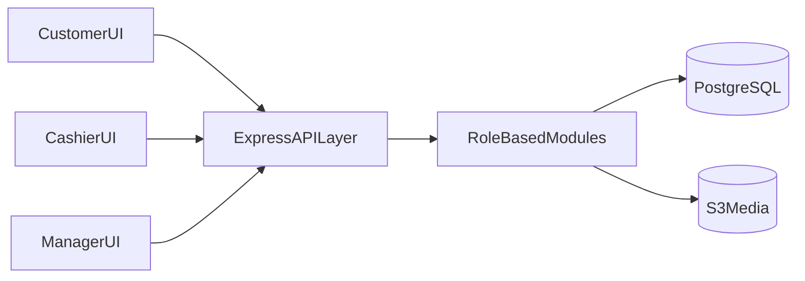
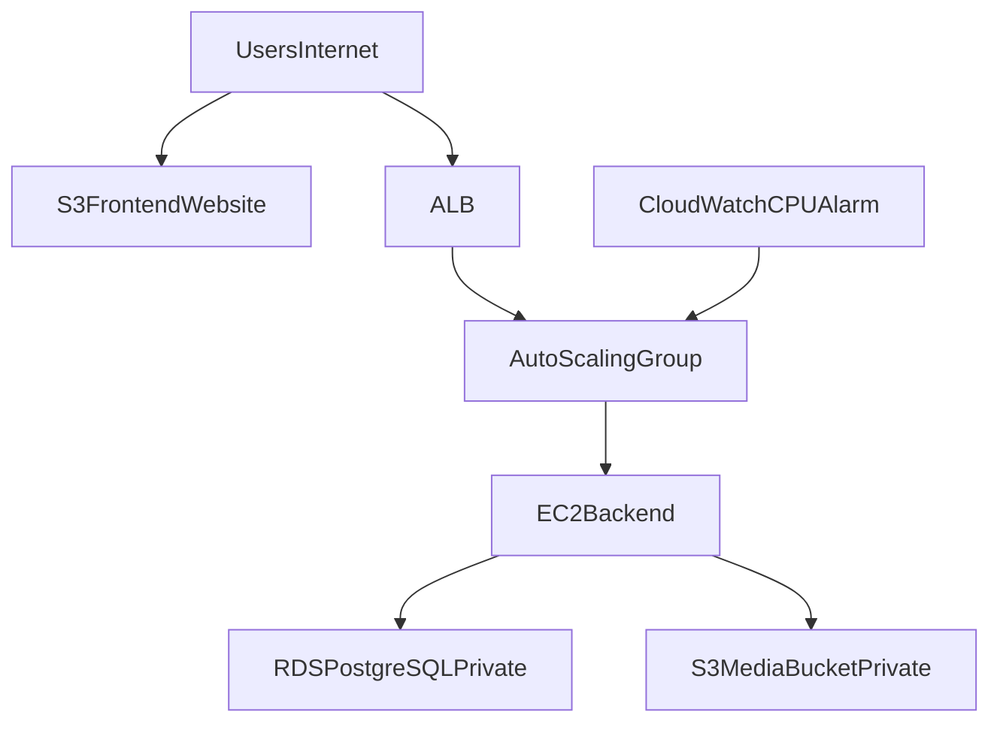
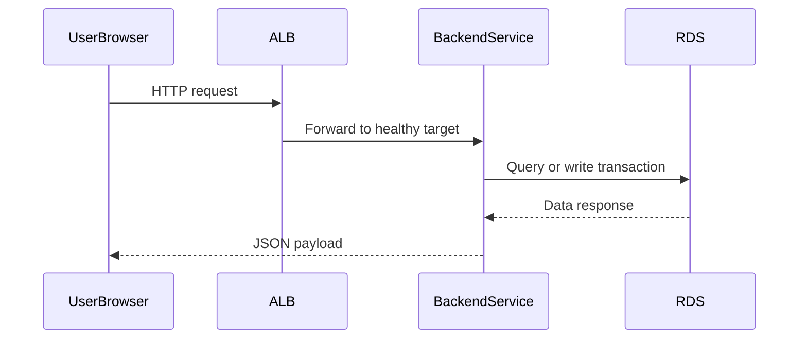
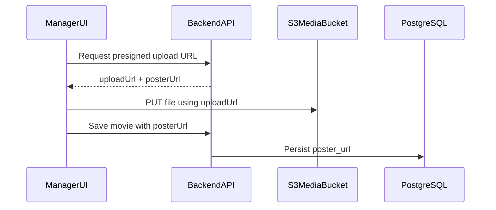
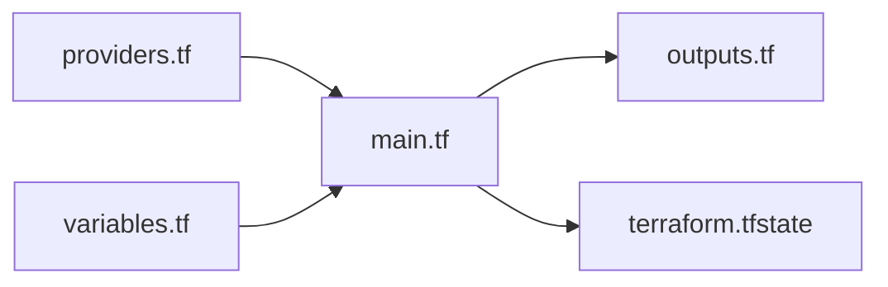

# GRAND CINEPLEX Project Report

## 1. Executive Summary

GRAND CINEPLEX is a full-stack cinema management platform designed for three operational roles:
- Customer (online discovery and booking)
- Cashier (in-person booking and payment handling)
- Manager (catalog, scheduling, operations oversight)

The project combines a role-oriented web architecture with cloud infrastructure provisioning through Terraform on AWS. The system supports movie and screening management, seat booking flows, ticketing/payment paths, and deployment automation patterns suitable for academic and production-oriented evolution.

---

## 2. Project Objectives

Primary goals:
- Deliver a role-based web application with clear domain separation.
- Implement reliable backend APIs over PostgreSQL.
- Support operational workflows for cinema business processes.
- Provision reproducible cloud infrastructure using Terraform.
- Establish a deployment baseline for scaling and observability.

---

## 3. Solution Overview

### 3.1 Application Domains

- **Customer domain**: browse movies, view schedules, select seats, book and pay.
- **Cashier domain**: walk-in transactions and assisted booking management.
- **Manager domain**: administer movies, screenings, theaters, staff, and reports.

### 3.2 Technology Stack

- **Frontend**: React + TypeScript + Tailwind + React Router
- **Backend**: Node.js + Express + Sequelize
- **Database**: PostgreSQL
- **Auth/Security**: JWT, role-based middleware
- **Cloud**: AWS (VPC, RDS, EC2 ASG, ALB, S3, CloudWatch)
- **IaC**: Terraform

---

## 4. Application Architecture

### 4.1 Backend Modular Structure

The backend is organized by role under `src/server/src/app/`:
- `customer/`
- `cashier/`
- `manager/`

Each module includes route-controller logic and shares common middleware and database models.

### 4.2 Data Layer

The database model includes core cinema entities:
- cinemas, theaters, seats
- movies, screenings
- customers, staff
- bookings, tickets, payments

This schema supports operational consistency across ticketing and screening workflows.

---

## 5. Cloud Architecture (Terraform Provisioned)

The Terraform layer defines a complete baseline environment.

### 5.1 Provisioned Layers

1. **Network**
   - VPC, IGW, public/private subnets, route table
2. **Database**
   - private PostgreSQL RDS in DB subnet group
3. **Compute**
   - EC2 launch template + AutoScalingGroup
4. **Traffic**
   - ALB + target group + listener
5. **Storage**
   - S3 frontend static bucket + S3 media bucket
6. **Monitoring**
   - CloudWatch CPU alarm tied to ASG

### 5.2 Terraform Outputs and Operational Value

Produced outputs:
- `alb_dns_name` -> backend base endpoint for frontend API calls
- `db_endpoint` / `rds_endpoint` -> DB connectivity endpoint
- `s3_website_endpoint` -> static frontend hosting endpoint

These outputs are critical hand-off values between infrastructure and application deployment.

---

## 6. End-to-End Operational Flow

### 6.1 User Request Path

### 6.2 Media Upload Path (Presigned URL)

---

## 7. Deployment and Data Initialization Workflow

### 7.1 Infrastructure Deployment

1. `terraform init`
2. `terraform plan`
3. `terraform apply`
4. capture outputs (`alb_dns_name`, `db_endpoint`, `s3_website_endpoint`)

### 7.2 Database Preparation

After infrastructure:
- apply schema (`DDL.sql`) where needed
- seed baseline or full sample data (`fresh_DML.sql` / `DataInsertion.sql`)

Because RDS is private, seeding must typically run from inside the VPC boundary.

### 7.3 Frontend and Backend Configuration

- Set frontend runtime build variable:
  - `VITE_API_BASE_URL=http://<alb_dns_name>`
- Deploy frontend static assets to frontend S3 bucket.
- Verify backend health endpoint via ALB target health.

---

## 8. Security and Reliability Considerations

Current strengths:
- Private RDS placement
- Role-based backend access patterns
- ALB health checks
- Infrastructure codified with Terraform

Improvement opportunities:
- tighten SSH ingress scope
- reduce broad IAM permissions to least privilege
- add HTTPS/ACM and optional WAF
- adopt remote Terraform state backend with locking
- add CI/CD deployment pipelines

---

## 9. Cloud-Centric Evaluation

### 9.1 Benefits Achieved

- Reproducible environment provisioning
- Clear separation of network, compute, data, and storage layers
- Scalable backend entry via ALB + ASG
- Cloud-native static hosting and media storage pattern

### 9.2 Gaps to Address for Production

- immutable artifact deployment strategy
- robust secrets and parameter management
- autoscaling and observability tuning
- hardened network boundaries and TLS everywhere

---

## 10. Conclusion

GRAND CINEPLEX demonstrates a complete full-stack and cloud deployment lifecycle: role-oriented product design, database-backed service architecture, and Terraform-based AWS provisioning. The platform already supports core cinema operations and establishes a strong cloud foundation. With incremental hardening (security, CI/CD, HTTPS, and operational controls), the project can transition from academic prototype to production-grade service architecture.

---

## Appendix A. Terraform Structure Reference

---

## Appendix B. Document Map

- Product and setup guide: `README.md`
- Infrastructure deep-dive: `TERRAFORM.md`
- Comprehensive architecture report: `REPORT.md`

