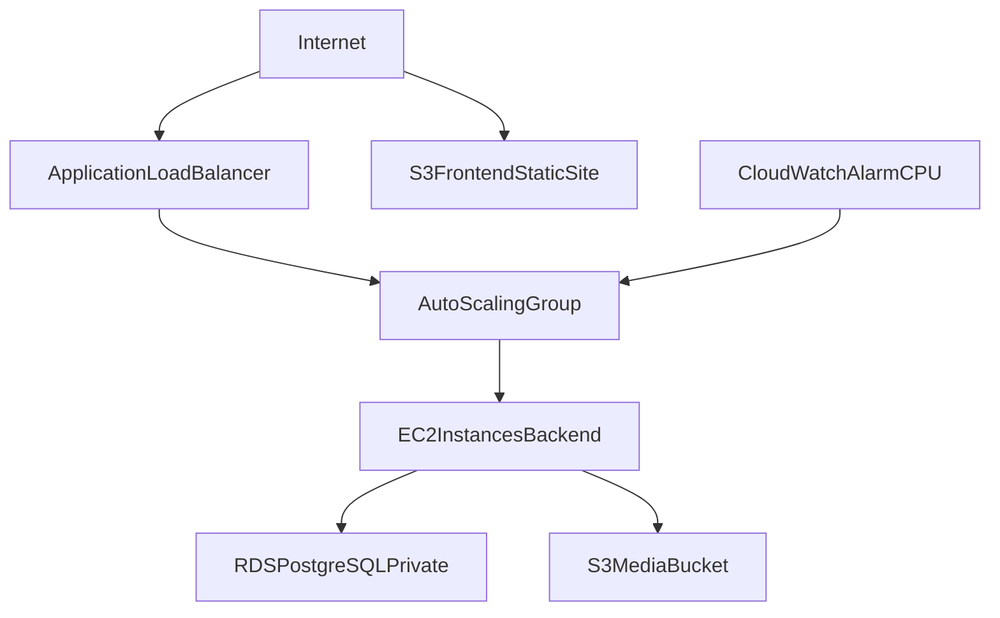
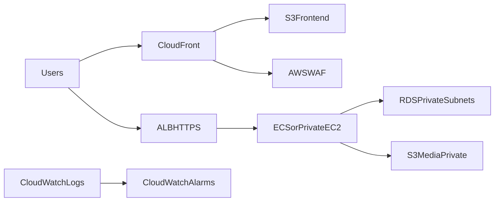

# Terraform Infrastructure Guide

## 1. Purpose

This document explains the AWS infrastructure defined in `terraform/` for GRAND CINEPLEX. It covers:
- what resources are provisioned
- how resources connect
- what outputs are produced
- how to complete application deployment after Terraform apply

Terraform files:
- `terraform/providers.tf`
- `terraform/variables.tf`
- `terraform/main.tf`
- `terraform/outputs.tf`

---

## 2. High-Level Architecture



---

## 3. Resource Breakdown by Layer

### 3.1 Provider and Variables

Defined in:
- `terraform/providers.tf`
- `terraform/variables.tf`

Key inputs:
- `aws_region` (default `ap-southeast-1`)
- `db_username` (sensitive)
- `db_password` (sensitive)

---

### 3.2 Network Layer

Defined in `terraform/main.tf`:
- `aws_vpc.grand_cineplex_vpc` (`10.0.0.0/16`)
- `aws_internet_gateway.grand_cineplex_igw`
- Subnets:
  - `aws_subnet.public_subnet` (`10.0.1.0/24`)
  - `aws_subnet.private_subnet_1` (`10.0.2.0/24`)
  - `aws_subnet.private_subnet_2` (`10.0.3.0/24`)
- Public route table + association

Intent:
- Public subnet supports internet-facing resources.
- Private subnets isolate database resources.

---

### 3.3 Database Layer

Resources:
- `aws_security_group.rds_sg` (Postgres `5432` allowed from VPC CIDR)
- `aws_db_subnet_group.rds_subnet_group` (private subnets)
- `aws_db_instance.grand_cineplex_db` (PostgreSQL, `db.t3.micro`, private)

Notes:
- Database is not publicly accessible.
- Access typically occurs from EC2 or other VPC resources.

---

### 3.4 Compute and Runtime Layer

Resources:
- IAM role/profile for EC2:
  - `aws_iam_role.ec2_s3_role`
  - `aws_iam_instance_profile.ec2_profile`
- Attachments:
  - `AmazonS3FullAccess`
  - `CloudWatchAgentServerPolicy`
- `aws_security_group.ec2_sg` (HTTP `80`, SSH `22`, all egress)
- `aws_launch_template.cineplex_lt`
- `aws_autoscaling_group.cineplex_asg`

Launch template user-data performs:
1. install Node.js + Git
2. clone application repository
3. create backend `.env`
4. install dependencies and run app with PM2

---

### 3.5 Load Balancing Layer

Resources:
- `aws_lb.cineplex_alb` (internet-facing ALB)
- `aws_lb_target_group.cineplex_tg`
- `aws_lb_listener.cineplex_listener` (HTTP 80 forward to target group)
- `aws_autoscaling_attachment.asg_attachment`

Health check:
- target group checks `path = "/health"`

---

### 3.6 Storage Layer

Resources:
- Frontend static hosting bucket:
  - `aws_s3_bucket.frontend_bucket`
  - `aws_s3_bucket_website_configuration.frontend_web`
  - public access block and bucket policy for public reads
- Media bucket:
  - `aws_s3_bucket.media_bucket`
  - `aws_s3_bucket_public_access_block.media_access` (private)

Intent:
- Frontend build artifacts served from S3 website endpoint.
- Application media uploaded to media bucket.

---

### 3.7 Monitoring Layer

Resource:
- `aws_cloudwatch_metric_alarm.high_cpu_alarm`

Tracks:
- EC2 AutoScalingGroup CPU utilization threshold (`>70`)

---

## 4. Output Values

Defined in `terraform/outputs.tf`:
- `db_endpoint` (RDS endpoint)
- `alb_dns_name` (backend public entry)
- `s3_website_endpoint` (frontend static site URL)
- `rds_endpoint` (duplicate of db endpoint)

Practical usage:
- backend DB config uses `db_endpoint`
- frontend API config uses `alb_dns_name`
- frontend hosting/test URL uses `s3_website_endpoint`

---

## 5. Deployment Workflow

## 5.1 Apply Infrastructure

```bash
cd terraform
terraform init
terraform plan -var="db_username=<db_user>" -var="db_password=<db_pass>"
terraform apply -var="db_username=<db_user>" -var="db_password=<db_pass>"
```

## 5.2 Read Outputs

```bash
terraform output
terraform output alb_dns_name
terraform output db_endpoint
terraform output s3_website_endpoint
```

## 5.3 Configure Application

- Backend:
  - ensure runtime `.env` uses correct DB endpoint and S3 variables
- Frontend:
  - set `VITE_API_BASE_URL=http://<alb_dns_name>`
  - rebuild frontend

## 5.4 Database Initialization and Seeding

Common sequence:
1. Create schema using `src/server/src/data/DDL.sql` (if tables are absent)
2. Seed baseline data with one of:
   - `src/shared/data/fresh_DML.sql`
   - `src/shared/data/DataInsertion.sql`

Because RDS is private, run seeding from:
- an instance inside the VPC, or
- temporary controlled network access

## 5.5 Frontend Static Deployment to S3

1. Build client app
2. Upload `src/client/dist` contents to frontend S3 bucket
3. Validate via `s3_website_endpoint`

---

## 6. Operational Checklist

- `terraform apply` completed without drift/errors
- ALB health checks are green
- backend reachable via ALB DNS
- database reachable from backend runtime
- schema initialized and seed loaded
- frontend uses `VITE_API_BASE_URL` pointing to ALB
- frontend files uploaded to S3 and publicly accessible
- media uploads from app path are functional

---

## 7. Known Risks and Improvement Opportunities

- Bucket names are globally unique in AWS; static names can collide.
- EC2 security group allows SSH from all IPs; restrict to trusted CIDR.
- `AmazonS3FullAccess` is broad; replace with least-privilege policy.
- Consider NAT gateway/private app instances if stronger network isolation is required.
- Add remote state backend (e.g., S3 + DynamoDB locking) for team workflows.
- Add HTTPS with ACM + ALB listener 443 for production security.
- Add CI/CD for:
  - Terraform plan/apply pipeline
  - frontend build + S3 sync
  - backend rollout strategy

---

## 8. Suggested Production-Grade Enhancements



- Put CloudFront in front of S3 frontend.
- Add TLS termination (ACM) and HTTPS-only access.
- Run backend in private subnets with controlled egress.
- Add structured logging, dashboards, and alert routing.

