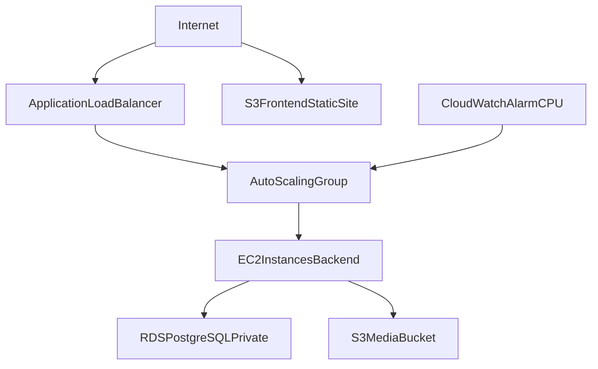
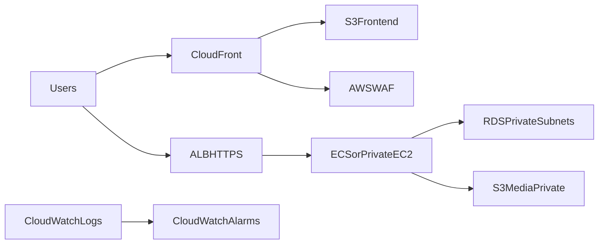

# Terraform Infrastructure Guide

## 1. Purpose

This document explains the AWS infrastructure defined in `terraform/` for GRAND CINEPLEX. It covers:
- what resources are provisioned
- how resources connect
- what outputs are produced
- how to complete application deployment after Terraform apply

Terraform files:
- `terraform/providers.tf`
- `terraform/variables.tf`
- `terraform/main.tf`
- `terraform/outputs.tf`

---

## 2. High-Level Architecture



---

## 3. Resource Breakdown by Layer

### 3.1 Provider and Variables

Defined in:
- `terraform/providers.tf`
- `terraform/variables.tf`

Key inputs:
- `aws_region` (default `ap-southeast-1`)
- `db_username` (sensitive)
- `db_password` (sensitive)
- `jwt_secret` (sensitive) — written to the backend `.env` on EC2 (via launch template user-data) so JWT signing matches across instances; use a long random string.
- `cors_allowed_origins` (list of strings, default `["*"]`) — S3 **media** bucket CORS `AllowedOrigin` values for browser PUT (presigned uploads) and GET (poster images). Restrict to your frontend website URL(s) in production.

---

### 3.2 Network Layer

Defined in `terraform/main.tf`:
- `aws_vpc.grand_cineplex_vpc` (`10.0.0.0/16`)
- `aws_internet_gateway.grand_cineplex_igw`
- Subnets:
  - `aws_subnet.public_subnet` (`10.0.1.0/24`)
  - `aws_subnet.private_subnet_1` (`10.0.2.0/24`)
  - `aws_subnet.private_subnet_2` (`10.0.3.0/24`)
- Public route table + association

Intent:
- Public subnet supports internet-facing resources.
- Private subnets isolate database resources.

---

### 3.3 Database Layer

Resources:
- `aws_security_group.rds_sg` — PostgreSQL **5432** allowed **only** from `aws_security_group.ec2_sg` (application instances), not from the open VPC CIDR. This ensures RDS accepts connections from the Auto Scaling Group while avoiding overly broad ingress.
- `aws_db_subnet_group.rds_subnet_group` (private subnets)
- `aws_db_instance.grand_cineplex_db` (PostgreSQL, `db.t3.micro`, private)

Notes:
- Database is not publicly accessible.
- EC2 instances in `ec2_sg` can connect; operators seeding from a laptop must use **Session Manager**, a **bastion**, or run `psql` **on an existing EC2 instance** in the VPC.

**Dependency:** `aws_security_group.ec2_sg` is declared **before** `rds_sg` so the RDS rule can reference the EC2 security group ID.

---

### 3.4 Compute and Runtime Layer

Resources:
- IAM role/profile for EC2:
  - `aws_iam_role.ec2_s3_role`
  - `aws_iam_instance_profile.ec2_profile`
- Attachments:
  - `AmazonS3FullAccess`
  - `CloudWatchAgentServerPolicy`
- `aws_security_group.ec2_sg` (HTTP `80`, SSH `22`, all egress) — defined **before** the RDS layer so RDS can reference it
- `aws_launch_template.grand_cineplex_lt`
- `aws_autoscaling_group.grand_cineplex_asg` (`depends_on` the RDS instance so the database exists before instances bootstrap)

Launch template user-data performs:
1. Install Node.js + Git
2. Clone application repository
3. Create backend `.env` (`PORT`, `DATABASE_URL` with **URL-encoded** password, `S3_BUCKET`, `AWS_REGION`, `JWT_SECRET` from `var.jwt_secret`)
4. `npm install` and run the app with PM2

---

### 3.5 Load Balancing Layer

Resources:
- `aws_lb.grand_cineplex_alb` (internet-facing ALB)
- `aws_lb_target_group.grand_cineplex_tg`
- `aws_lb_listener.grand_cineplex_listener` (HTTP 80 forward to target group)
- `aws_autoscaling_attachment.grand_cineplex_asg_attachment`

Health check:
- target group checks `path = "/health"`

---

### 3.6 Storage Layer

Resources:
- Frontend static hosting bucket:
  - `aws_s3_bucket.frontend_bucket`
  - `aws_s3_bucket_website_configuration.frontend_web`
  - public access block and bucket policy for public reads (`GetObject` on `/*`)
- Media bucket (posters / presigned uploads):
  - `aws_s3_bucket.media_bucket`
  - `aws_s3_bucket_public_access_block.media_access` — blocks **ACL-based** public access but **allows** a bucket policy for public reads on a prefix
  - `aws_s3_bucket_cors_configuration.media_cors` — allows **GET**, **PUT**, **HEAD** from `var.cors_allowed_origins` (default `*`) so browsers can upload via presigned PUT and load images
  - `aws_s3_bucket_policy.media_posters_public_read` — **public `GetObject`** only on `movie-posters/*` (matches backend key prefix), so `posterUrl` values work in `` without making the whole bucket public

Intent:
- Frontend build artifacts served from the S3 website endpoint.
- Poster files upload with presigned URLs; objects under `movie-posters/` are readable anonymously via HTTPS object URL.

---

### 3.7 Monitoring Layer

Resource:
- `aws_cloudwatch_metric_alarm.grand_cineplex_high_cpu_alarm`

Tracks:
- EC2 AutoScalingGroup CPU utilization threshold (`>70`)

---

## 4. Output Values

Defined in `terraform/outputs.tf`:
- `db_endpoint` (RDS endpoint)
- `alb_dns_name` (backend public entry)
- `s3_website_endpoint` (frontend static site URL)
- `rds_endpoint` (duplicate of db endpoint)

Practical usage:
- backend DB config uses `db_endpoint`
- frontend API config uses `alb_dns_name`
- frontend hosting/test URL uses `s3_website_endpoint`

---

## 5. Deployment Workflow

## 5.1 Apply Infrastructure

```bash
cd terraform
terraform init
terraform plan -var="db_username=<db_user>" -var="db_password=<db_pass>" -var="jwt_secret=<long_random_secret>"
terraform apply -var="db_username=<db_user>" -var="db_password=<db_pass>" -var="jwt_secret=<long_random_secret>"
```

## 5.2 Read Outputs

```bash
terraform output
terraform output alb_dns_name
terraform output db_endpoint
terraform output s3_website_endpoint
```

## 5.3 Configure Application

- Backend:
  - ensure runtime `.env` uses correct DB endpoint and S3 variables
- Frontend:
  - set `VITE_API_BASE_URL=http://<alb_dns_name>`
  - rebuild frontend

## 5.4 Database Initialization and Seeding (manual)

Terraform **does not** apply schema or seed data. After `apply`, use **`terraform output db_endpoint`** (or `rds_endpoint`) with your master username and password to connect to database `grand_cineplex_db`.

**Typical operator flow:**
1. SSH to an EC2 instance in the ASG (same VPC/security context as the app), or use AWS Session Manager / a bastion.
2. Install `postgresql-client` if needed; run `psql` or restore a dump against the RDS endpoint from the output.
3. Alternatively, copy SQL files to the instance and execute them.

Project SQL references (paths may vary by branch):
- Schema: `src/server/src/data/DDL.sql` (or your Sequelize migration workflow)
- Sample data: `src/shared/data/fresh_DML.sql`, `DataInsertion.sql`, etc.

Until this step is done, the API will fail at runtime when it touches the database.

## 5.5 Frontend Static Deployment to S3

1. Build client app
2. Upload `src/client/dist` contents to frontend S3 bucket
3. Validate via `s3_website_endpoint`

---

## 6. Operational Checklist

- `terraform apply` completed without drift/errors
- ALB health checks are green
- Backend reachable via ALB DNS
- **Schema and seed applied manually** using connection info from `db_endpoint` (from EC2 in VPC or bastion)
- Database reachable from backend runtime (same EC2 SG as allowed on RDS)
- Frontend uses `VITE_API_BASE_URL` pointing to ALB
- Frontend files uploaded to S3 and publicly accessible
- Media bucket CORS + `movie-posters/*` read policy applied by Terraform; manager poster upload flow works end-to-end

---

## 7. Known Risks and Improvement Opportunities

- Bucket names are globally unique in AWS; static names can collide.
- EC2 security group allows SSH from all IPs; restrict to trusted CIDR.
- `AmazonS3FullAccess` is broad; replace with least-privilege policy.
- Consider NAT gateway/private app instances if stronger network isolation is required.
- Add remote state backend (e.g., S3 + DynamoDB locking) for team workflows.
- Add HTTPS with ACM + ALB listener 443 for production security.
- Add CI/CD for:
  - Terraform plan/apply pipeline
  - frontend build + S3 sync
  - backend rollout strategy

---

## 8. Suggested Production-Grade Enhancements



- Put CloudFront in front of S3 frontend.
- Add TLS termination (ACM) and HTTPS-only access.
- Run backend in private subnets with controlled egress.
- Add structured logging, dashboards, and alert routing.

